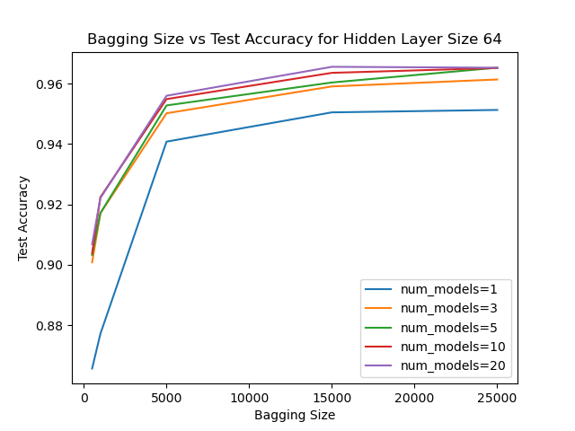
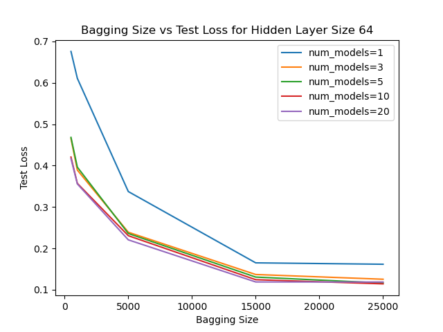
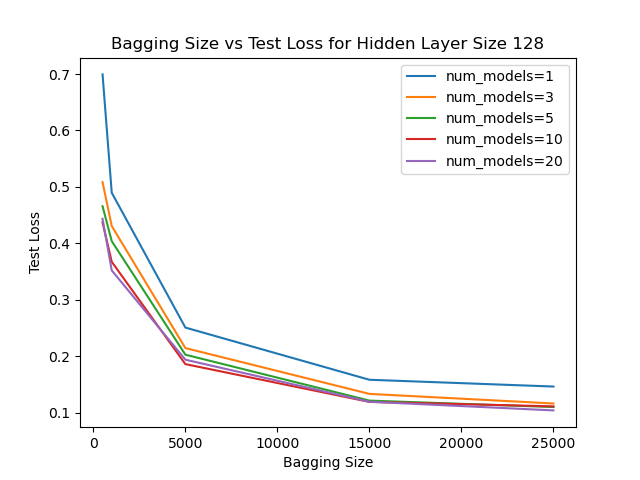
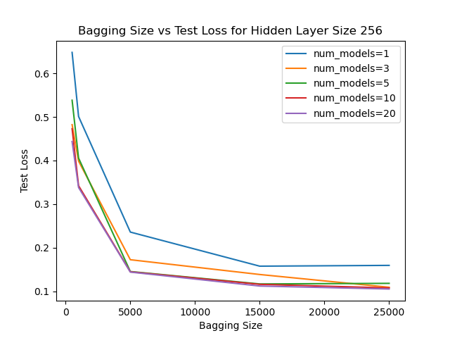
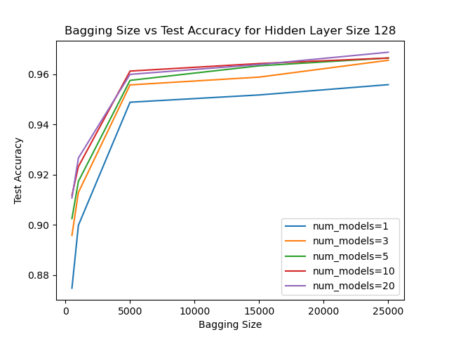
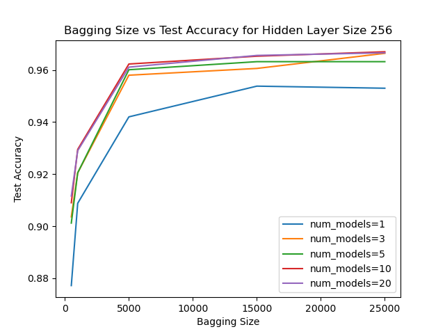

# deep-ensemble-networks

## Overview
This project implements a bagging ensemble of neural networks using PyTorch and tests the model’s performance on the MNIST dataset. By combining multiple neural networks (ensemble learning), this approach aims to reduce variance and improve the robustness and generalization of the model. The ensemble consists of multiple models trained on different random subsets of the data, and their predictions are aggregated (via averaging or voting) to make the final prediction.

## Experiment
We tested to see how the number of models in the ensemble, bagging size, and hidden layer size affected performance of the model. We tested configurations of the following training parameters:

• Number of Models in the Ensemble: [1, 3, 5, 10, 20]

• Bagging Subset Size: [500, 1000, 5000, 15000, 25000]

• Hidden Layer Size of Individual Learners: [64, 128, 256]

We kept the training data (50,000 samples), validation data (10,000 samples), and testing data (10,000 samples) the same throughout the experiment. All models were trained with a starting learning rate of 0.01 and a batch size of 256. The models were trained for 50 epochs with early stopping based on the validation loss.

## Results
[Full Report](./results/Final%20Project%20Report.pdf)

